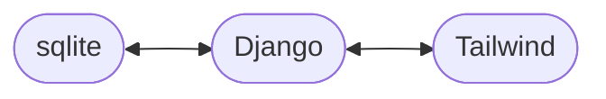

# 🍅 Django Mozza Timer

This is a simple Pomodoro application using Django, sqlite, Tailwind and vanilla JS.

_(I'm basically learning to start and improve a modern Django project from scratch)_



## Getting started

The project uses [uv](https://docs.astral.sh/uv) for dependencies.

```sh
uv sync
cd timers
uv run manage.py migrate
uv run manage.py runserver # server available at localhost:8000
```

Additionally, we depend on [tailwind 4](https://tailwindcss.com/), and therefore a node dependency tool.
We use [PNPM](https://pnpm.io/) and [node 22 LTS](https://nodejs.org/en/blog/release/v22.18.0).

[Tailwind standalone](https://github.com/tailwindlabs/tailwindcss/releases/tag/v4.1.11) might become an option in the future.

```sh
pnpm install
pnpm run css # for building
pnpm run css:watch # for development
```

In development, [Ruff](https://docs.astral.sh/ruff/) is also the primary formatter.

```sh
uv run ruff format
```

## Data modelling

Modelling a timer is fun, because we need to design it in a stateless way.


## Testing

Testing, relies on [pytest](https://docs.pytest.org/en/stable/)
and [pytest-django](https://pytest-django.readthedocs.io/en/latest/).

```sh
uv run pytest
```

## :sparkles: Django template components

To stay DRY, while keeping a good readability, some components' classes are stored in
utilities ([timers/lib/classes](./timers/timers/lib/classes.py)).

Those classes are available inside a template tag: `cx` in reference to [clsx](https://www.npmjs.com/package/clsx).

```html


<button class="">Hello</button>
<input class="" />
```

Currently there are 2 components:

- Button (`'button'`)
- Input (`'input'`)
